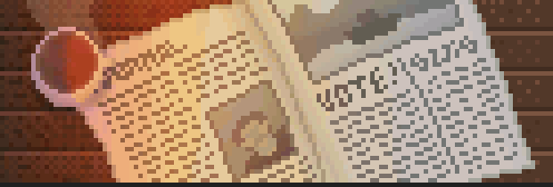

***Vote Now!*** is a game created in the context of a university programming class called "2D Video Games", supervised by Isaac Pante at the University of Lausanne. In this course, we learned to use [KaboomJS](https://kaboomjs.com/), which I am using for this project.

The game is available on [itch.io](https://jrante.itch.io/vote-now)and [GitHub Pages](https://antejr.github.io/Vote_Now/) !

***Vote Now!*** is a minimalist strategy game. The premise of the game is that you play as a political party aiming to pass a bill in Switzerland by propagandizing to influence voters' opinions. The game plays kind of like [Reigns](https://store.steampowered.com/app/474750/Reigns/), as in you have a choice of 2 actions that you can pick from at a time. The game works using 3 main variables:

* **Money.** This determines if you can buy campaign materials. It can be earned by asking for donations from voters or sponsors.
* **Votes.** This determines how much in your favor the vote is going. From 0 (no voting intentions in your favor) to 100 (all voting intentions to your favor), it will be influenced by purchasing add-space, distributing flyers and organizing events.
* **Optics.** This determines if your party's image is in good shape or not. It is a modifier to the votes you get. This means that if you have 1.1 optics, it will add 1.1x the amount of votes you would normally get.

I own all of the visual and audio assets except for the fonts [Old Newspaper Types](https://www.dafont.com/oldnewspapertypes.font) and [Kitchen Sink](https://polyducks.itch.io/kitchen-sink-textmode-font), both of which are free to use with attribution. All visuals were made using [Aseprite](https://www.aseprite.org/). All audio was made using [BeepBox](https://www.beepbox.co/).

## Credits

Voting Data:

* [Chronological Repertoire of Votations](https://www.bk.admin.ch/ch/f/pore/va/vab_2_2_4_1.html?lang=fr) on the Swiss Confederation's website
* [SwissVotes](https://swissvotes.ch/page/home)

Historical Context & Commentary

* [Le Temps](https://www.letempsarchives.ch/)' archives (The ___Gazette de Lausanne___ and the ___Journal de Genève___)
* [Historical Dictionary of Switzerland](https://hls-dhs-dss.ch/fr/)
* [History of Switzerland's Social Security](https://www.histoiredelasecuritesociale.ch/synthese)

Posters:

* [Against the Swiss Railways' Buyout](https://hls-dhs-dss.ch/fr/articles/042003/2012-11-27/) (Flyer)
* [For the Sickness and Accident Insurance Bill](https://www.histoiredelasecuritesociale.ch/synthese#c63) (Commemorative Poster)
* [For the Elderly, Invalids and Veterans Insurance Bill](https://www.histoiredelasecuritesociale.ch/synthese#c69) (Poster)
* [For the Crisis Initiative](https://www.posters.nb.admin.ch/discovery/fulldisplay?docid=alma991000511849703978&context=L&vid=41SNL_53_INST:posters&lang=fr&search_scope=MyInstitution&adaptor=Local%20Search%20Engine&tab=LibraryCatalog&query=any,contains,initiative%20de%20crise&offset=0) (Poster)
* [For Romansch as a National Language](https://hls-dhs-dss.ch/fr/articles/024594/2012-06-19/) (Magazine Cover)
* [For the Unfair Competition Bill](https://www.swissinfo.ch/fre/un-si%C3%A8cle-d-affiches-politiques--muscl%C3%A9es-/257884) (Poster)
* [For the Civil Protection Militia](https://www.posters.nb.admin.ch/discovery/fulldisplay?docid=alma991000140679703978&context=L&vid=41SNL_53_INST:posters&lang=fr&search_scope=MyInstitution&adaptor=Local%20Search%20Engine&tab=LibraryCatalog&query=any,contains,zivilschutz&offset=0) (Flyer)
* [For Women's Suffrage](https://www.posters.nb.admin.ch/discovery/fulldisplay?docid=alma991000208909703978&context=L&vid=41SNL_53_INST:posters&lang=fr&search_scope=MyInstitution&adaptor=Local%20Search%20Engine&tab=LibraryCatalog&query=any,contains,Mitspracherecht%20der%20Frauen%20auch%20im%20Bund&offset=0) (Poster)
* [For the Removal of Mandatory Military Service for Men](https://swissvotes.ch/vote/357.00) (Poster)
* [For the Prohibition of New Nuclear Power Plants' Construction](https://www.posters.nb.admin.ch/discovery/fulldisplay?docid=alma991000400309703978&context=L&vid=41SNL_53_INST:posters&lang=fr&search_scope=MyInstitution&adaptor=Local%20Search%20Engine&tab=LibraryCatalog&query=any,contains,nucl%C3%A9aire&offset=0) (Poster)
* [For the Adhesion to the UN](https://swissvotes.ch/vote/485.00?term=%22ONU%22#search) (Poster)
* [For the Restriction in Constructing New Secondary Residences](https://espazium.s3.eu-central-1.amazonaws.com/files/migration/images/586d022dd521d.jpg) (Poster)
* [For the Law Against Discrimination Based on Sexual Orientation](https://www.psju.ch/wp-content/uploads/2020/02/StopalahaineOUI.png) (Web banner)
* [For Marriage and Adoption For All](https://www.mariage-oui.ch/typo3conf/ext/va_template/Resources/Public/img/og-image-fr.jpg) (Web banner)
* [Against the Reform of the Elderly's Insurance](https://www.watson.ch/fr/imgdb/ce9f/Qx,A,0,0,5751,3834,2396,1597,958,639/4784293144599269) (Poster)
