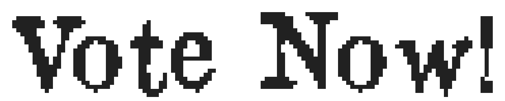

***Vote Now!*** is a game created in the context of a university programming class called "2D Video Games", supervised by Isaac Pante at the University of Lausanne. In this course, we learned to use [KaboomJS](https://kaboomjs.com/), which I am using for this project.

The game is available on [itch.io](https://jrante.itch.io/vote-now)!

***Vote Now!*** is a minimalist strategy game. The premise of the game is that you play as a political party aiming to pass a bill in Switzerland by propagandizing to influence voters' opinions. The game plays kind of like [Reigns](https://store.steampowered.com/app/474750/Reigns/), as in you have a choice of 2 actions that you can pick from at a time. The game works using 3 main variables:

* **Money.** This determines if you can buy campaign materials. It can be earned by asking for donations from voters or sponsors.
* **Votes.** This determines how much in your favor the vote is going. From 0 (no voting intentions in your favor) to 100 (all voting intentions to your favor), it will be influenced by purchasing add-space, distributing flyers and organizing events.
* **Optics.** This determines if your party's image is in good shape or not. It is a modifier to the votes you get. This means that if you have 1.1 optics, it will add 1.1x the amount of votes you would normally get.

## Developer journal
### From 25.06 to 25.07 (about 25 hours)
Most of this period has been dedicated to create most of the graphical elements using Aseprite to draw and GIMP to format the tilemaps. All is not done yet, as I want to have a menu, as well as a visual presentation/overlay to make the game feel like a whole. Plans have also been made to vary the elements' lighting to add variety, though this will come a later stage if I have time. Basic tiling and mapping of the textures as animations has been done, and basic placement of the visual for prototyping has developped.

### 02.08 (about 8 hours)
Basic game system and scenario mechanics is done. The game is technically operationnal. More options to the sprites' lighting for more variety. Better sprite system with a file and a loadSpriteAtlas() for each animations. Still needs:

* More scenarios (currently one)
* Make hovers work.
* A start screen and a menu
* An end screen
* Canvas centering in the middle of the page

### 03.08 (about 8 hours)
Game UI is now done. Game operationnal and functionnal from basic testing. Better sprite management. More scenarios based on research; use of certain means of propaganda simply were not possible and/or common at the time (for example before 1922 the Swiss Radio stations did not exist). Canvas is now centered. Still needs:

* A start screen and a menu
* Music and sounds
* Better code optimization and modularity

### 04.08 (about 8 hours)
The main flow of the game is done: you start at a menu, select a level, and play it, see the ending message depending on your victory or failure, go back to the menu, and can play again. A lot of fixes have been implemented, and most of the code has been commented. Musics are currently being writtent and slowly implemented, each time one is done. What is left to be done is:

* Finish the music and sounds
* Have a better code optimization and modularity

### 05.08 (about 3 hours)
The code has been optimized to the best of my abilities, and the music/sounds have been fully implemented. As fas as I'm concerned, the project is finished. It has been uploaded on itch.io and is functionning there.

________________________
I own all of the visual and audio assets except for the fonts [Old Newspaper Types](https://www.dafont.com/oldnewspapertypes.font) and [Kitchen Sink](https://polyducks.itch.io/kitchen-sink-textmode-font), both of which are free to use with attribution. All visuals were made using [Aseprite](https://www.aseprite.org/). All audio was made using [BeepBox](https://www.beepbox.co/).
